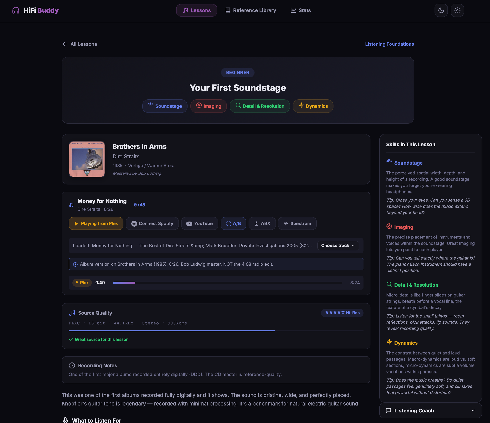
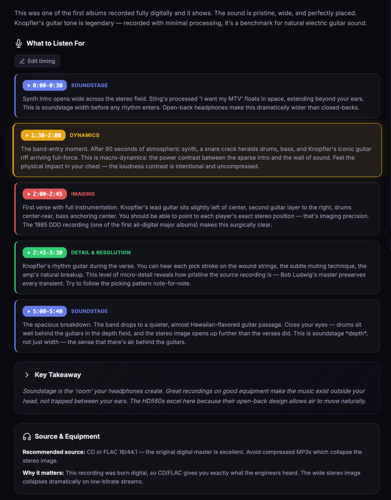
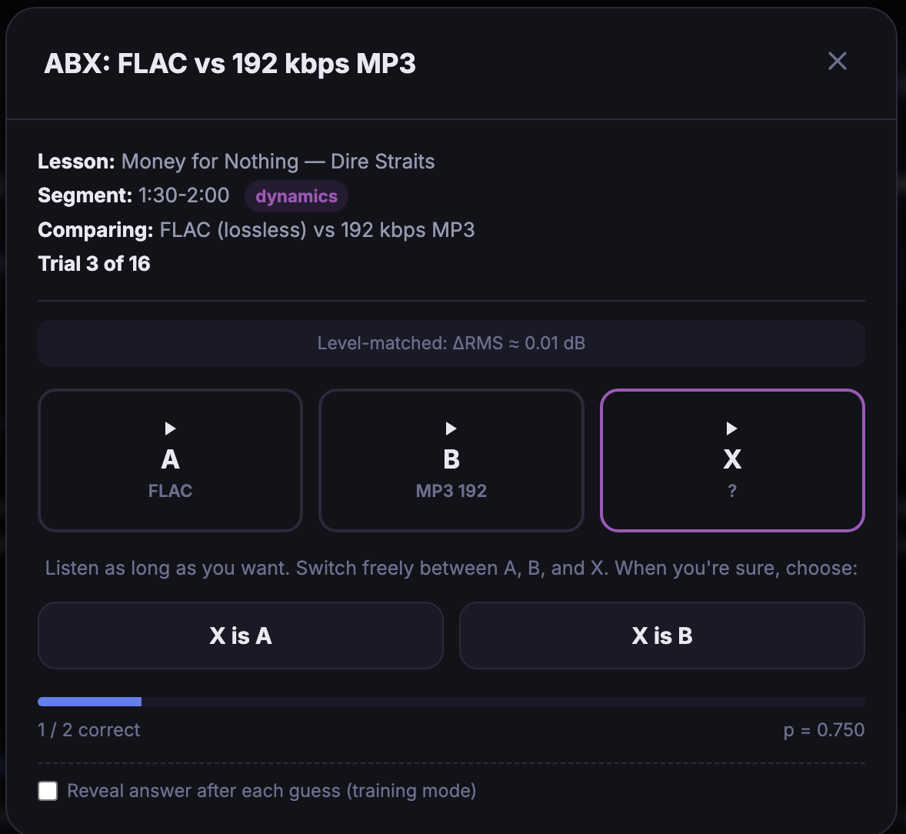
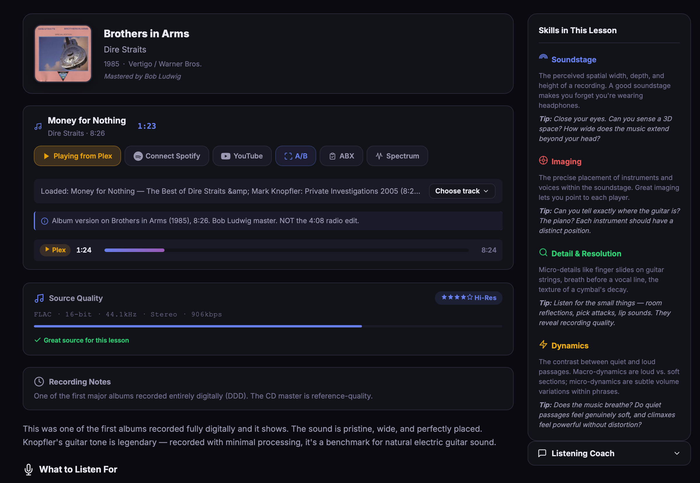

# HiFi Buddy

Critical-listening tutor for audiophiles. Train your ears on real reference recordings — 30 curated lessons, ABX blind testing, equipment-aware annotations, frequency visualizer, and a searchable reference clip library.

> Stop guessing. Start hearing.

## Screenshots


*One screen, the whole lesson — album context, source-aware playback, inline quality detection, and a live skills sidebar.*


*Each lesson breaks the track into timestamped passages tagged by skill — soundstage, imaging, dynamics, detail. Click any range to seek there.*


*Proper double-blind ABX testing — level-matched FLAC vs MP3, 16 trials, binomial p-value verdict.*


*Reads the actual stream — FLAC, bit depth, sample rate, bitrate, channels — not just "lossless ✓".*

## Repository layout

- **[hifi-buddy-app/](./hifi-buddy-app/)** — the runtime app. Standalone,
  self-hosted. Python + vanilla JS, no build step. Start here:
  [hifi-buddy-app/README.md](./hifi-buddy-app/README.md).
- **[hifi-buddy-site/](./hifi-buddy-site/)** — the marketing site at
  [hifibuddy.net](https://hifibuddy.net). Static HTML/CSS/JS, deployed on
  Vercel.
- **[hifi-buddy-app/docs/](./hifi-buddy-app/docs/)** — user documentation:
  setup, integrations, ABX methodology, troubleshooting.

## What it does

HiFi Buddy teaches the things audiophiles actually talk about — **soundstage,
imaging, dynamics, transients, micro-detail, tonal color, bass quality,
separation, air, layering** — using timestamped passages of real reference
tracks (Dire Straits, Steely Dan, Diana Krall, Aphex Twin, Bill Evans, Massive
Attack, and 20+ more).

You play the song from your **Plex library** (lossless FLAC — recommended),
**Spotify Premium** (256 kbps Ogg via the Web Playback SDK), or a **local FLAC
folder**. The app calls out exactly what to listen for and when. Click any
timestamp to seek directly there. When you've internalized a lesson, take the
**ABX test** — proper double-blind methodology, 16 trials, level-matched FLAC
vs MP3 comparison, with a binomial p-value and a blunt verdict telling you
whether you can actually distinguish the formats.

## Quickstart (run the app locally)

```bash
git clone https://github.com/hifibuddy/hifi-buddy.git
cd hifi-buddy/hifi-buddy-app
python3 server.py
```

Then open **http://127.0.0.1:8091/** in your browser. (Use `127.0.0.1`,
**not** `localhost` — Spotify's OAuth requires the loopback IP form for HTTP
redirect URIs.)

No build step, no dependencies, no Node, no bundler. Pure Python 3 stdlib +
vanilla browser JS.

Full setup instructions (Plex, Spotify, Local FLAC, optional Claude/Ollama)
live in [hifi-buddy-app/README.md](./hifi-buddy-app/README.md).

## Privacy

Runs entirely locally. No telemetry. All settings (Plex token, Spotify auth,
API keys, ABX results, equipment profile) live in your browser's localStorage.
Nothing leaves your machine unless you explicitly use the Claude AI listening
guide (which calls the Anthropic API directly with your key).

## License

MIT — see [LICENSE](./LICENSE).

## Contributing

Contributions welcome. The lesson catalog
(`hifi-buddy-app/data/hifi-guide.json`), reference clips
(`hifi-buddy-app/data/reference-clips.json`), and reference catalog
(`hifi-buddy-app/data/reference-catalog.json`) are particularly easy entry
points for new content.

Bug reports and feature requests:
[issues](https://github.com/hifibuddy/hifi-buddy/issues).
